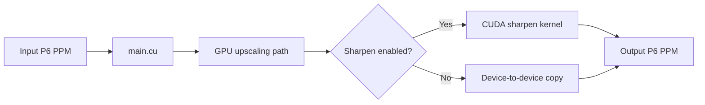

# Documentation

This guide set describes the current CUDA Image Upscaler implementation and its operating assumptions.

| Document | Purpose |
| --- | --- |
| [Architecture](architecture.md) | Components, dependencies, memory ownership, and the execution paths. |
| [Command-line reference](cli.md) | Syntax, option rules, defaults, validation, and examples. |
| [Build and runtime setup](build-and-runtime.md) | CUDA and ONNX Runtime installation, build command, deployment, and troubleshooting. |
| [Image pipeline](image-pipeline.md) | PPM constraints, CUDA processing stages, modes, and performance considerations. |
| [Contributing notes](contributing.md) | Code layout, verification expectations, and generated-file policy. |

## Quick orientation

The executable accepts an 8-bit RGB P6 PPM image, selects one upscaling path, optionally sharpens the result, and writes another P6 PPM image. Geometric paths execute only CUDA kernels. The Real-ESRGAN path additionally uses the ONNX Runtime CUDA provider and is fixed at 4x.

Return to the [project README](../README.md) for the short introduction and common commands.
