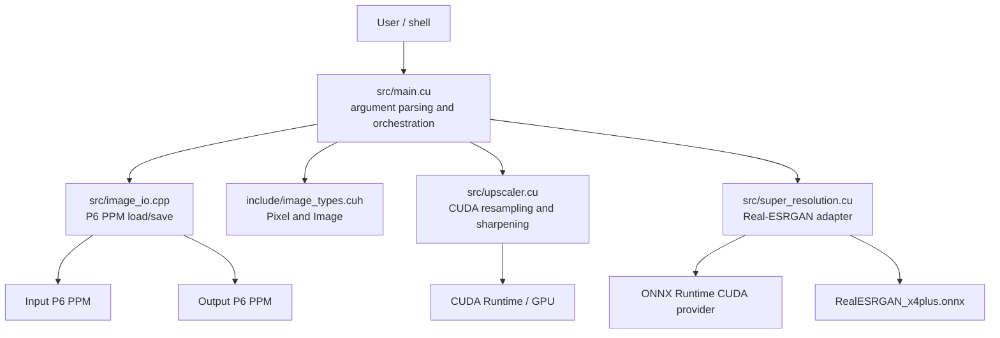
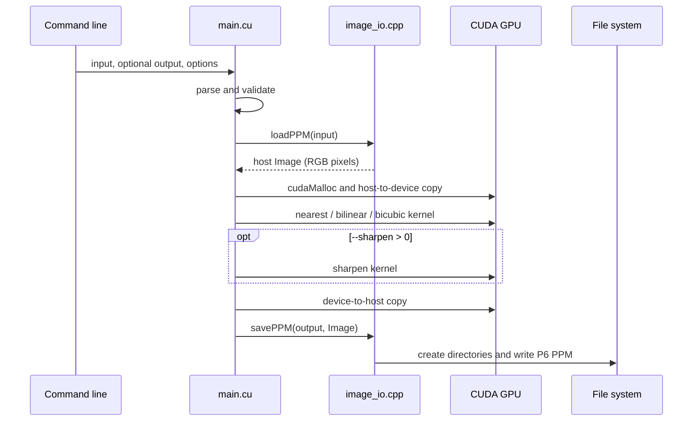
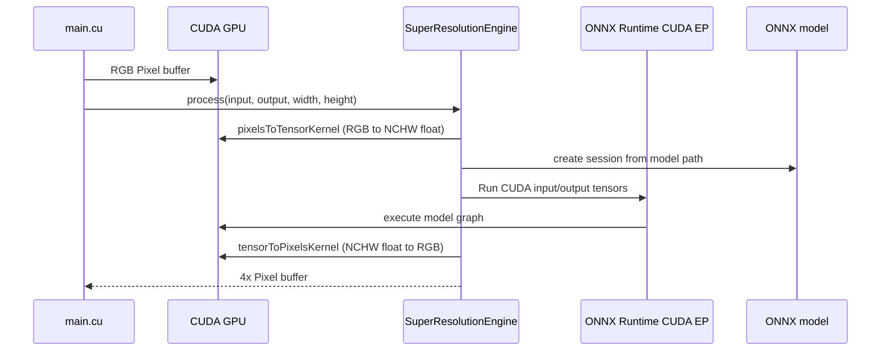

# Architecture

## Component map



## Responsibilities

| Area | Files | Responsibility |
| --- | --- | --- |
| Entry point | `src/main.cu` | Parses the command line, validates mode constraints, allocates host/device buffers, chooses an upscaler, applies optional sharpening, and saves the result. |
| Image representation | `include/image_types.cuh` | Defines `Pixel` as three unsigned-byte RGB channels and `Image` as width, height, and host pixel pointer. |
| PPM I/O | `include/image_io.h`, `src/image_io.cpp` | Loads and saves binary P6 PPM images and creates output parent directories. |
| CUDA resampling | `include/upscaler.cuh`, `src/upscaler.cu` | Launches nearest, bilinear, bicubic, and sharpening kernels. The global `SCALE` is set once by `main`. |
| AI backend | `include/super_resolution.cuh`, `src/super_resolution.cu` | Converts RGB pixels to NCHW float tensors, invokes ONNX Runtime on CUDA device 0, and converts the result back to RGB pixels. |
| Utilities | `tools/` | Converts image formats, exports the ONNX model, and checks ONNX Runtime providers. |

## Geometric processing sequence



## Real-ESRGAN processing sequence



The model path is configurable with `--model`, but the current engine assumes the model produces exactly four times the input width and height. `main.cu` therefore rejects `--type realesrgan` unless `--scale 4` is supplied.

## Memory and ownership

```mermaid
flowchart LR
    H1[Host input Image\nnew Pixel[]] -->|cudaMemcpy H2D| D1[Device input Pixel*]
    D1 --> K[Selected upscaling path]
    K --> D2[Device upscaled Pixel*]
    D2 --> S[Optional sharpen]
    S --> D3[Device output Pixel*]
    D3 -->|cudaMemcpy D2H| H2[Host output Image\nnew Pixel[]]
    H2 --> W[savePPM]

    SR[Real-ESRGAN only] --> T1[Device input NCHW float*]
    SR --> T2[Device output NCHW float*]
```

`main.cu` releases the three primary device buffers and both host images after successful saving. The Real-ESRGAN engine releases its tensor buffers on both successful and exceptional paths. CUDA error checks are applied around allocations, copies, launches, and synchronizations.

## Dependency boundary

- Nearest, bilinear, bicubic, and sharpening use CUDA Runtime only at runtime.
- This source tree currently compiles the Real-ESRGAN adapter into the same executable, so its headers and import library are build dependencies.
- ONNX Runtime CUDA DLLs and model files are bundled in this repository. They remain third-party assets subject to their own distribution terms.
