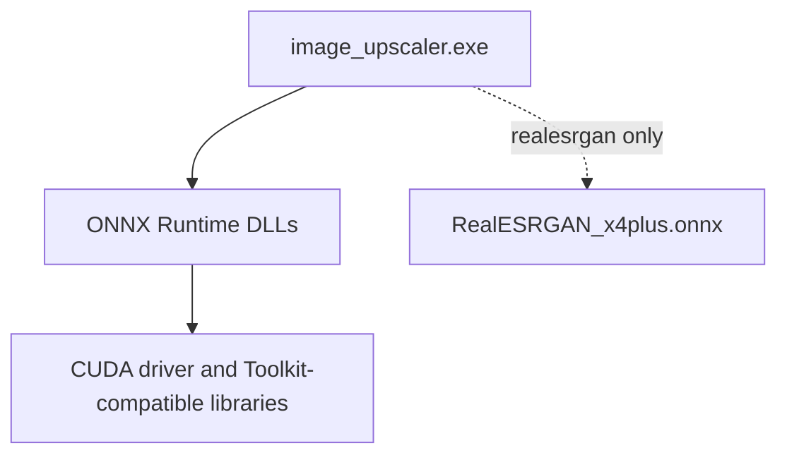

# Build and runtime setup

## Prerequisites

Install:

1. A CUDA-capable NVIDIA GPU and a driver compatible with your CUDA Toolkit.
2. NVIDIA CUDA Toolkit, including `nvcc`.
3. A C++17 host compiler supported by that Toolkit.
4. For Real-ESRGAN builds, the Windows GPU package of ONNX Runtime that matches your CUDA environment.
5. Optional conversion support: Python 3.8+ and Pillow (`python -m pip install -r tools\requirements.txt`).

## Local SDK layout

The repository includes the model and ONNX Runtime SDK binaries. The expected layout is:

```text
third_party/onnxruntime/
  include/onnxruntime_cxx_api.h
  lib/onnxruntime.lib
  lib/onnxruntime.dll
  lib/onnxruntime_providers_cuda.dll
model/
  RealESRGAN_x4plus.onnx
```

The exact ONNX Runtime package can include additional provider DLLs. Keep all required DLLs together with the executable at runtime, and review their third-party terms before redistributing.

## Build command

From the repository root:

```powershell
nvcc -std=c++17 -Iinclude -Ithird_party\onnxruntime\include src\main.cu src\upscaler.cu src\super_resolution.cu src\image_io.cpp -Lthird_party\onnxruntime\lib -lonnxruntime -o image_upscaler.exe
```

This command compiles all CUDA/C++ translation units and links the ONNX Runtime import library. Adjust include and library paths if the SDK is elsewhere.

## Runtime deployment



For geometric modes, the model is not opened. The executable still requires the ONNX Runtime DLL dependency because the Real-ESRGAN implementation is linked into this build. Place matching ONNX Runtime DLLs beside the executable or make them discoverable through the normal Windows DLL search path.

## Verification

```powershell
# Compile and display the CLI contract
.\image_upscaler.exe --help

# Verify a geometric path
.\image_upscaler.exe assets\input.ppm output\verification.ppm --scale 2 --type bilinear

# Inspect installed ONNX Runtime Python providers, if using the Python environment
python tools\test_onnx.py
```

The successful geometric run prints the selected input, output, scale, type, sharpening amount, and a completion message.

## Troubleshooting

| Symptom | Likely cause | Suggested check |
| --- | --- | --- |
| `nvcc` is not recognized | CUDA Toolkit is not installed or not on `PATH`. | Use the CUDA Toolkit command prompt or add its `bin` directory to `PATH`. |
| Missing ONNX Runtime symbols at link time | Incorrect `-L` path or import library. | Confirm `third_party\onnxruntime\lib\onnxruntime.lib` exists. |
| Application cannot start because a DLL is missing | Runtime DLLs are absent or incompatible. | Copy matching ONNX Runtime GPU package DLLs next to the executable. |
| CUDA provider initialization fails | ONNX Runtime, CUDA, driver, or provider DLL versions do not match. | Check provider availability with `tools\test_onnx.py` and use a compatible ORT GPU package. |
| Real-ESRGAN fails before inference | Missing/unreadable model or non-4x scale. | Confirm `--model` path and use `--scale 4`. |
| Input is rejected | The file is not an 8-bit RGB P6 PPM. | Convert it with `tools\convert_to_ppm.py`. |
