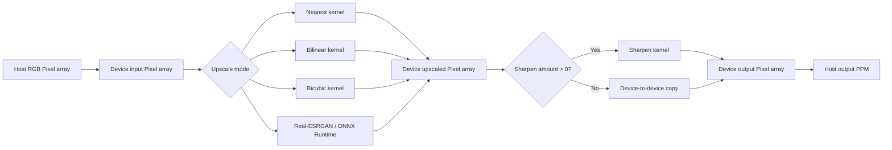

# Image pipeline

## Native format

The native reader accepts binary P6 PPM files only:

- magic number: `P6`;
- width and height in the header;
- maximum channel value: `255`;
- pixel payload: interleaved 8-bit red, green, blue values.

Use the Pillow conversion scripts for PNG, JPEG, and other common source formats. Output is always P6 PPM; use `convert_from_ppm.py` to create a PNG.

## CUDA pipeline



All geometric kernels use two-dimensional 16 by 16 thread blocks. The grid rounds up to cover the requested output dimensions, and out-of-bounds threads return without writing.

## Geometric modes

| Mode | Sampling behavior | Typical use |
| --- | --- | --- |
| Nearest | Maps each output pixel to an input pixel with integer division. | Pixel art and hard-edged enlargement. |
| Bilinear | Blends a 2 by 2 source neighborhood. | Fast, smooth general-purpose scaling. |
| Bicubic | Weights a 4 by 4 neighborhood using a cubic kernel. | Sharper geometric scaling with more work per output pixel. |

## Sharpening

The optional sharpening kernel uses the center pixel and four direct neighbors. It adds a scaled local-contrast term to each channel and clamps the result to `[0, 255]`. Set `--sharpen 0` (the default) to skip it. Values such as `0.2` to `0.5` are modest starting points; stronger values can accentuate noise and halos.

## Real-ESRGAN data conversion

The AI path converts an interleaved `Pixel` buffer into a device-resident NCHW float tensor:

```text
input:  Pixel[y * width + x] -> R, G, B in [0, 255]
tensor: [1, 3, height, width] -> R, G, B in [0.0, 1.0]
```

ONNX Runtime consumes and produces CUDA-backed tensors. The output tensor is clamped to `[0.0, 1.0]`, rounded to the nearest byte, and written to the output `Pixel` buffer. The configured RealESRGAN x4plus model requires a 4x scale.

## Capacity planning

With scale `s`, output pixel count is `inputWidth * inputHeight * s²`. The geometric workflow holds one input device buffer plus two output-sized device buffers; the host also holds input and output pixel arrays. Real-ESRGAN additionally allocates float tensor buffers with three channels, so it has substantially higher GPU-memory demand.

Use modest dimensions for the first run, especially with 4x scaling. A 4x image has 16 times as many pixels as its source.
